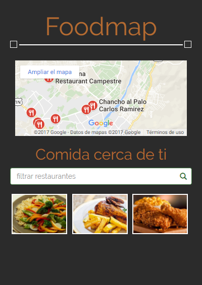
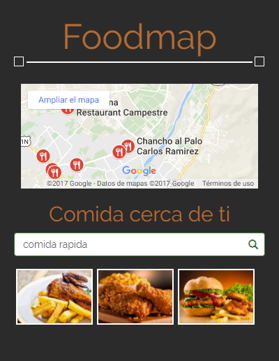

# FOODMAP

* **Sprint 3:** _CREA TU PROPIA RED SOCIAL_
* **Unidad 3:** _AGILIZA TU DESARROLLO_

***

Crea una web-app que a través de un input pueda filtrar los restaurantes que se encuentran cerca de ti (Tú decides la estructura que tendrán tus datos, puedes crear una lista de restaurantes en un arreglo, en un objeto, de manera individual. El diseño es totalmente libre).

## DESARROLLO

FLUJO DE LA APLICACIÓN:

En la vista principal se muestran todos los restaurantes "cerca de ti" junto con el input para filtrar tu elección, en esta caso aparecen los restaurantes que se encuentran en el distrito de Lima.

Para la elección del filtro se muestran únicamente aquellos restaurantes que cumplan con la condición, las opciones de filtrado son:
1. Por tipo de comida

* comida criolla
* comida vegetariana
* comida rápida
* comida japonesa

2. Por distrito

* miraflores
* lima
* lince

Las imagenes cuentan con un evento mouseover y un modal con el detalle del restaurante de elección.

## RESULTADO

